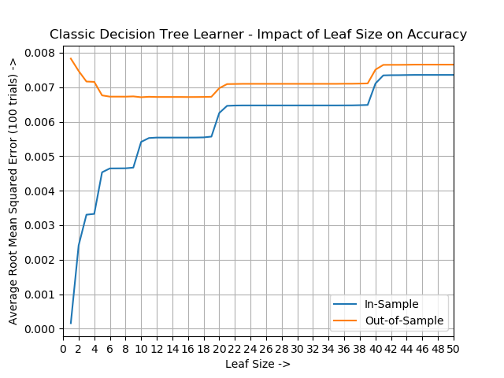
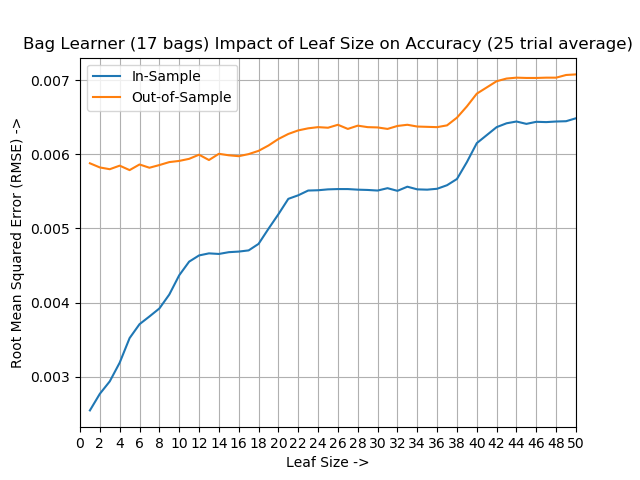
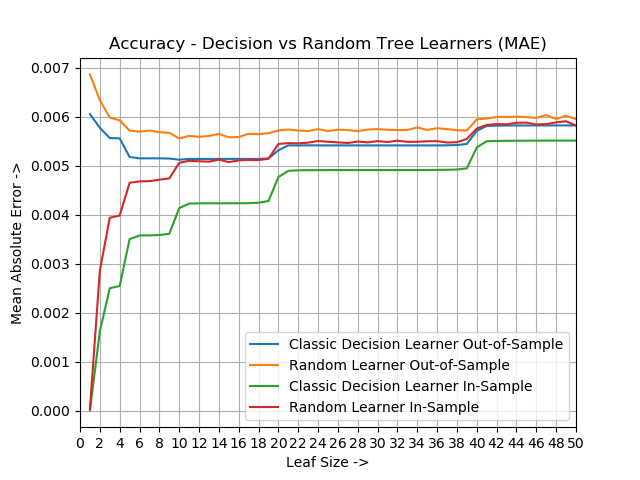
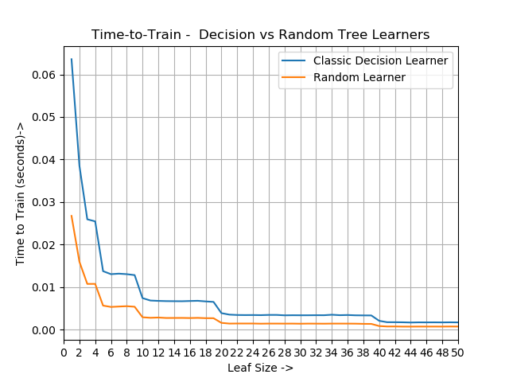

# Implementation-of-Classification-And-Regression-Trees-from-Scratch
This project presents implementations of the popular Classification And Regression Trees (CART) supervised Machine Learning algorithms, built from scratch. Four CART algorithms are implemented as reusable classes and evaluated for relative strengths and weaknesses against popular real world datasets. They attempt to predict output for new input based on previous modeling from a set of known observations.

- 📌 **Decision Tree Learner**
- 🔀 **Random Tree Learner**
- 🧺 **Bagged Learner (Ensemble)**
- 🤪 **Insane Learner** (complex ensemble construct)

The base Decision Learner implementation is based on an algorithm proposed by Quinlan (1985), known as the "ID3" algorithm. The Random Tree, Bag, and Insane Learners are all based on the base learner. The Insane Learner demonstrates the power combinng and forming complex learners. 

A detailed report including results, findings, and discussion is available [here](assets/report.pdf).

## 💡 Motivation

Supervised learners like CART are foundational to many predictive analytics systems. However, their practical effectiveness hinges on mitigating overfitting and understanding how algorithm design impacts learning outcomes. This project empirically investigates:
- How learner architecture impacts model accuracy and generalization.
- The efficacy of bagging in reducing overfitting.
- Trade-offs between prediction accuracy and training performance.

## 📊 Experiments & Findings

Three key experiments were designed to systematically assess model behavior under varying configurations:

### 🔍 Experiment 1: Overfitting in Decision Trees
- Explores how leaf size affects prediction accuracy.
- Demonstrates **overfitting** at lower leaf sizes (≤6).
- Visualizes **in-sample vs out-of-sample RMSE** across trials.
 

### 🧪 Experiment 2: Effectiveness of Bagging
- Uses a 17-bag ensemble of decision learners.
- Significantly reduces overfitting even at small leaf sizes.
- Confirms the **bias-smoothing power** of ensemble methods.

### ⚖️ Experiment 3: Decision Tree vs Random Tree
- Compares **MAE** and **training time** across 100 trials.
- Decision Trees outperform in accuracy.
- Random Trees excel in training speed.

## 📈 Summary of Results

| Metric               | Decision Tree      | Random Tree       | Bagged Learner     |
|----------------------|--------------------|-------------------|--------------------|
| Overfitting          | High (low leaf size) | High (low leaf size) | **Minimal** ✅     |
| Prediction Accuracy  | **Best** (non-overfit regions) | Lowest | High |
| Training Time        | Moderate to High   | **Lowest** 🚀     | Highest (multiple learners) |
| Query Time           | Not Evaluated (Future Work) | – | – |

